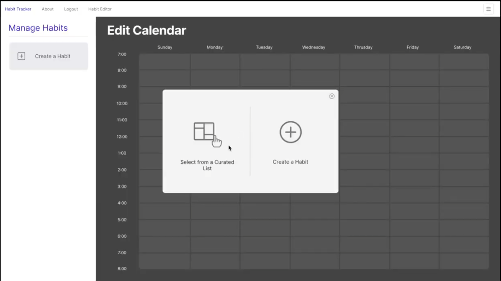
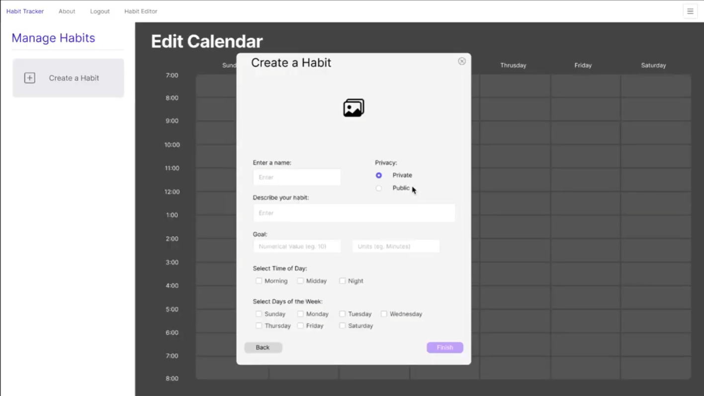
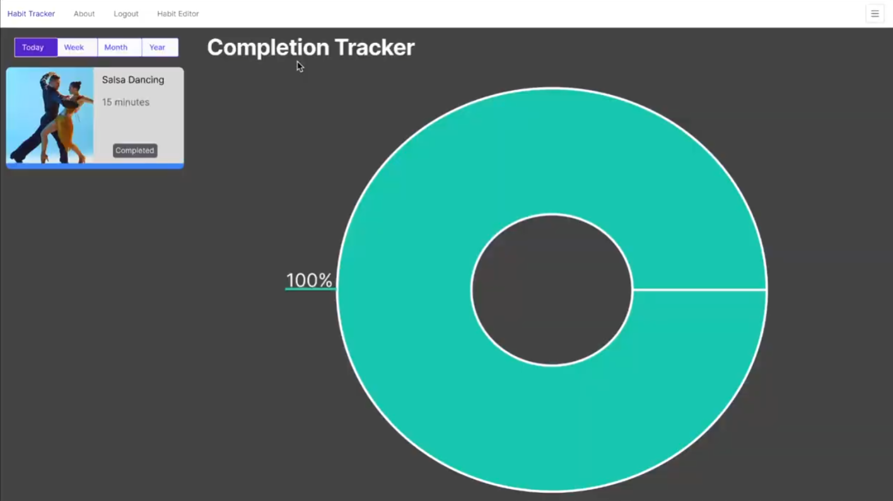
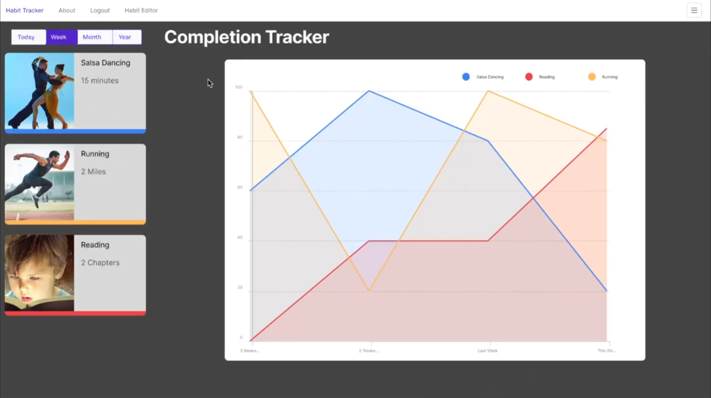

# GP4: Detailed UI Prototype Feedback Report
#### Authors: 
Kadyn Martinez - Uday Chandra Gollapally - Lokesh Repala - Sai Rikwith Daggu - Pavan Sesha Sai Kasukurti
#### Date: 2/23/2025

 

## Executive Summary
<!-- Objective: Briefly summarize the purpose of the feedback report and the main findings.

Overview of the Reviewed Prototype: Provide a quick overview of the prototype you reviewed, mentioning its intended purpose and target audience. -->
**Objectiveー** The following report is focused on the review and evaluation of the Habit Tracker application prototype by Team 4. The purpose of the report is to** perform a usability analysis** of the prototype demonstrated via video. By performing a usability analysis, our **teams are better equipped** to **meet user satisfaction** requirements as well as **enable preventative design** tactics reducing user error. Our methodology was to perform a **frame-by-frame analysis** of prototype video and come up with feedback. Feedback ranged from **minor inconveniences** for the user to more **critical error prone design patterns** which **reduce user satisfaction**.

**Areas of strength** are pointed out such as **cohesive design style** as well as a solid foundation to achieve **core functionality**. These areas are listed alongside **areas requiring improvement** such as **button placement** and visual consistency where there should be a **visual split to demonstrate differing functionality**. Finally a list of **prioritized recommendations** is given for the team to iterate on. All feedback is provided based on **empirical examination** in view of the **10 usability heuristics**.

**Overview of the Reviewed Prototypeー** The reviewed application in question is a habit tracking application aptly named "**Habit Tracker.**" The application is intended to be a comprehensive way to build habits by allowing the user to **designate time on a calendar** to perform the activity which the habit involves. The expectation is that performing this activity over some period of time (with the help of the tracker) will allow the user to stay motivated to continue the habit. The tracker does this with alarms, a "todo list" view, and analytics spanning multiple time frames enabling the user to see concrete progress over time.

## Methodology
<!-- Approach to Review: Describe how your group conducted the review. Include the aspects you focused on, such as usability,  functionality, etc
Tools and Techniques Used: Mention any specific tools (if any) or techniques used during the review process, such as heuristic evaluation, usability testing, or any checklist adhered to. -->
Our approach to review involved analyzing the video provided and focusing on aspects of usability, primarily as it pertains to Jakob Nielsen's 10 Usability Heuristics. Due to the lack of portable interactivity, we are unable to provide a first person perspective usability testing. We will instead evaluate from a third person perspective as was demonstrated in the video. We will also employ a frame by frame analysis which will be used to extend constructive feedback by giving tangible screenshot examples. 

## Detailed Feedback

### Usability
<!-- Navigation: Comment on the ease of navigation and finding information.
User Experience: Evaluate how intuitive and logical the user experience is from start to finish. -->
#### Navigation
The look is very simple and easy to understand. Navigation options are provided in a smart way, making sure to not confuse the user. Large icons and target areas provide adequate breathing room allowing users to easily digest options and paths within the interface. 

A large majority of the navigation is done via pop up modals which provide the user with a grounded view (root page) and child modals above the grounded view. While intuitive, its important to not let these modals stack as it can be frustrating to have a modal covered up. 
| First Modal                 | Overlapping / Overwriting modal |
| --------------------------- | ------------------------------- |
|  |     |

In the above sequence of navigation, there is a nested modal wherein it is implied there can be navigation between the two. The implication is made due to the "back" button being present on the right modal. However its unclear if the "X" on top would accomplish the same, or if the modal replaced the previous. This could be one area of possible improvement that will be discussed later.

#### User Experience
In terms of User Experience, the prototype performs well, logically moving from creation to data collection to finally displaying the newly created habit. These are minor demerits that can be discussed in regards to user experience. 

| Interactive View              | Analytics View            |
| ----------------------------- | ------------------------- |
|  |  |

The other area of possible contention would be that analytics and interaction are absorbed into the same view. This is exemplified in the side-by-side above. By switching the functionality within the same view and widgets, this can cause friction for the user.

### Functionality
<!-- Completeness: Assess the degree to which the prototype completely exposes the features and user interactions as defined in the Project Proposal's requirements. 
Core Features: Assess whether the core features work as expected and fulfill the Project Proposal's requirements.
Interactivity: Evaluate the interactivity of the prototype, including button responses, transitions, and animations.
Performance: Note any issues related to the prototype's performance, such as lag or unresponsive elements. -->
#### Completeness
To prototype as disclosed fulfils all the major requirements of the project proposal. Going further to have unique and engaging visualizations. There are however some minor objections to this point disclosed below.
- There were not at least 12 pre-defined habits, instead one was copy pasted.
- There were not any descriptions within the habits, unless "15 minutes a day" counted, however this feels more like a time dedication than description of the activity.
- There was no visibly disclosed way to allow users to schedule the same habit multiple times per day. 
- There does not seem to be any display of completion percentages, how many minutes were spent per task is only shown.

#### Core Features
Core features relating to the actual use of the prototype are present, users are able to successfully create habits, register habits, complete habits. Removal is demonstrated within the edit screen, as well as adjustment of data within the habit. 

#### Interactivity
Since interactivity is gauged via video, and implementation is performed via design tool prototype features, this section isn't applicable for evaluation.

#### Performance
Since interactivity is gauged via video, and implementation is performed via design tool prototype features, this section isn't applicable for evaluation.

### General Observations
<!-- Strengths: Highlight the strengths of the prototype, pointing out what aspects were particularly well-executed.
Areas for Improvement: Identify areas where the prototype could be improved, providing specific, actionable suggestions.
(Incorporate the "Jakob Nielsen’s 10 Usability Heuristics" (from the Week 3 lecture content) into your evaluation). -->
#### Strengths
The following points are areas in which the prototype excelled in.
- Clean Interface
  - The interface demonstrated is nicely laid out, following a minimalist flat color style that's cohesive and enjoyable to operate.
- Simplistic Design
  - Few buttons and navigation paths leave less chance for user error, a static navigation bar gives users a place to ground themselves to familiar views.
- Cards / Tiles
- Use of Cards / Tiles in design allow for recognition over time. Having habits occupy cards/tiles as demonstrated lets users know how to interact with familiar interfaces even if they are newly presented features.
- Visualizations
  - Graphical visualizations throughout make the UI more approachable.

#### Areas of Improvement
The following points are areas in which the prototype improves. These will be provided through the lens of Jakob Nielsen's 10 Usability Heuristics. 

- Visibility of system status
  - Though not demonstrated in the video prototype, consider adding a toast notification when creating and removing a habit to show visibility of internal status.
- User control and freedom
  - Adding and removing habits is a simplified process however there was no demonstrated method to undo a deletion of a card other than refilling all the information. Consider adding an undo feature or "archiving" a habit to be restored later.
- Consistency and standards
  - Cards are used in the "Manage Habits" section with a _delete_ button, but then in the "Habit Tracker" view with a _complete_ button. This breaks consistency between the cards. Consider adding a second button or having edit be a different interaction. 
  - Cards are reused in the "Today-Week-Month-Year" view, however, in the "Week-Month-Year" views cards lose their ability to complete. While this makes logical sense, the reuse of standards here has the potential to cause disconnect. Consider using a different display method to separate these views.
- Error prevention
  - Logout button in the navigation menu is in between other items which are clicked. This has the potential to lead to user error. Consider moving this to the right hand side so as to be separated from the normal navigational options.
- Aesthetic and minimalist design
  - The aesthetic is consistent and minimalist, however the completion tracker diverges from the design and style of the rest of the application. Consider using flat colors and more aesthetic presentation for analytical graphs. 
- Help users recognize, diagnose, and recover from errors
  - While not demonstrated in the video, consider adding a toast notification for errors to allow users to diagnose issues.
- Help and documentation
  - While not demonstrated in the video, consider adding a help page or an introduction tutorial to using the site guiding the user through basic actions.

## Suggested Improvements
<!-- Prioritized Recommendations: Offer a prioritized list of recommendations for improvement. This could range from quick wins to more significant changes that might require more time and resources.
Justification: Provide justification for each recommendation, explaining how it would enhance the prototype's usability, design, or functionality. -->
### Prioritized Recommendations
The below points are recommendations which should be prioritized to achieve the most value in terms of user satisfaction. Some suggestions are small in scope, others might require larger allocation of resources. This is not an exhaustive list but instead key discussion points which could be used to enhance the prototype's usability, design, and functionality.

1. Prevent nested modals
   - Preventing nested modals as seen above will help keep the UI clean and organized both for development as well as users. If a modal goes missing or a user is unable to return to the modal they want, it can cause friction.
2. Change tiles in the analytics / completion view
   - Habit tiles are reused in the "completion" view but also the analytics view. There are differences in how these are intended to be used but the visuals remain similar. It's also seemingly easy to click between these views as the analytics are provided in the same "tab header" as the "today" tab. By incorporating a different visual language, the user is less likely to be confused, therefore enhancing the usability of the application.
3. Account for mistaken habit deletion
   - Set forth a method or process for undoing a deletion as currently the process to reenable a deleted task is to reinput the information from scratch. This might also lose the previously obtained analytics if handled recklessly. Implementing this would make for a more cohesive and thought out user experience.
4. Relocate the logout button
   - Currently the logout button is between pages which would be used during active use. This forces the user to always be weary of clicking the wrong button thereby reducing user acclimation to the interface.
5. Remove habit creation multiselect UI elements
   - Select checker box makes little sense in the context of browsing curated habits, perhaps switching to clicking on the tile altogether would avoid user ambiguity.
6. Analytics graph visual cohesion
   - Change analytics graph views to be more in line with the overall style
7. Password confirmation
   - Have the user confirm their password in the signup section. If a new user is created without confirming their password and there was a typo in creation, the user will be locked out of their account with little recourse other than to follow the password recovery procedure. 

## Conclusions
<!-- Summarize the key points from the feedback, reiterating the most critical improvements suggested. -->
In conclusion, the Habit tracker demonstrated by group 4's prototype video follows the required specifications closely. Many of the major usability heuristics are met and exceeded. It is not without fault however as certain areas relating to navigation and functionality have room for improvement. This feedback comes with the broad knowledge that the prototype built with design-tool prototyping functionality can only perform so well. Future suggestions would be easier with a more tangible demonstration of the application in "MVP" form. 