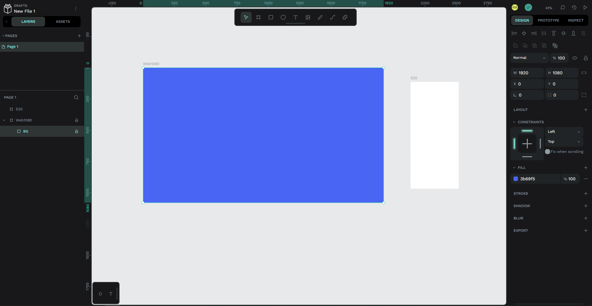
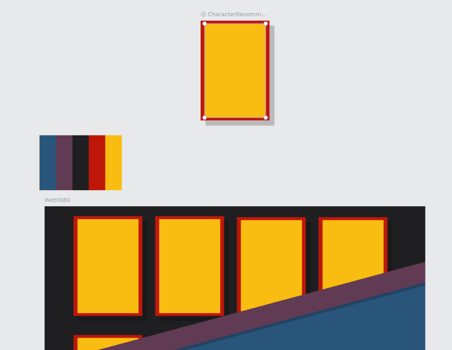
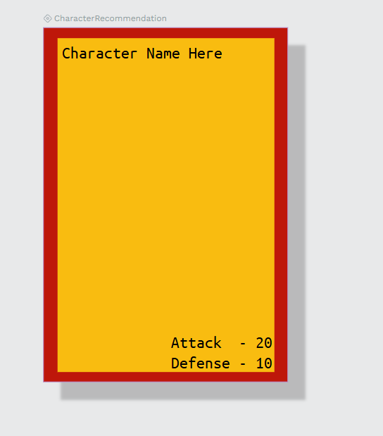
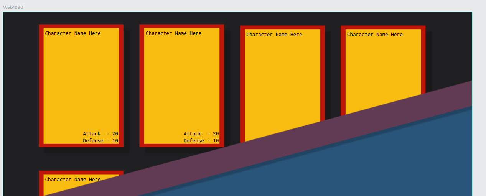
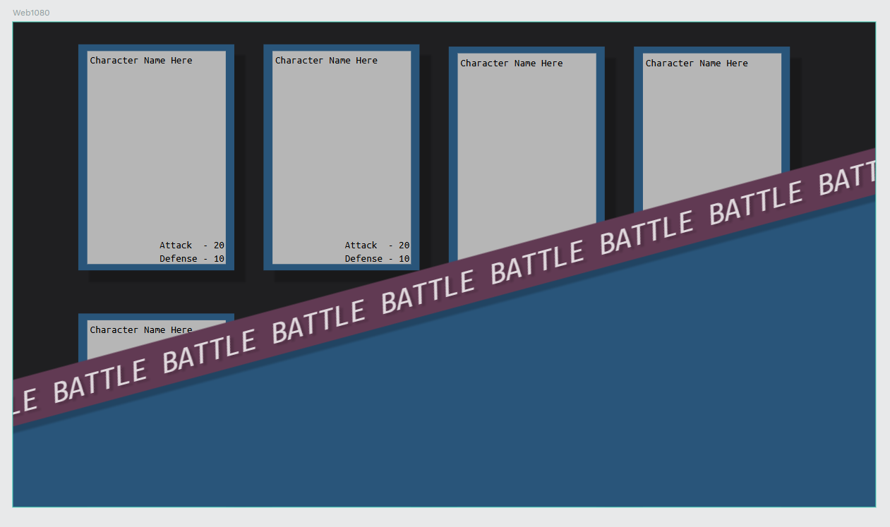
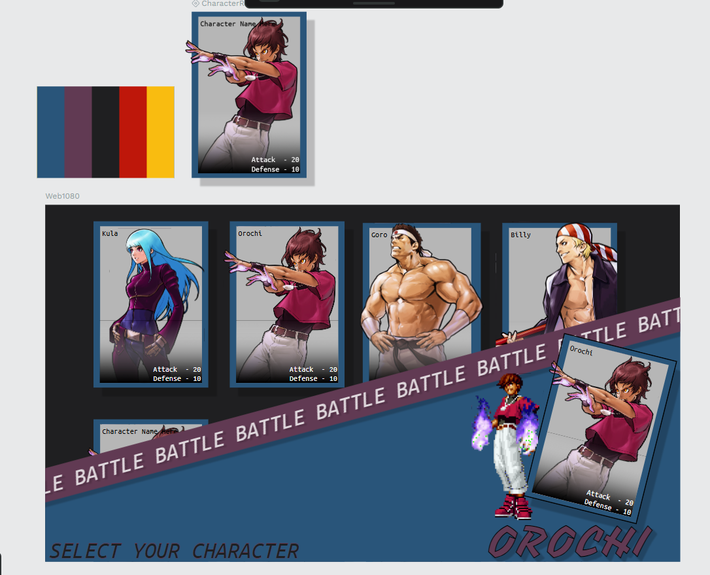

# PenPot Section

### Formal
// Formal entry here

#### Notes / Scratch pad
pros
- Design space is clean
- Very reminiscent of figma
- Open Source
- Self host-able
- Privacy and security
- Teamwork features and teams 
- FREE
- Allows whiteboarding (no miro and figjam.)
- Native CSS grid and flexbox support
- Transparent development
- Documentation is present but not in depth
  - https://help.penpot.app/user-guide/components/ (Component overrides but no info.)

cons
- Not as feature rich
- Difficult to transition to figma
- Some simple features are not intuitive 
  - Overriding components
  - Importing / replacing images
  - "State" 
- No State system (Impossible to make dynamic testing applications)
- Slow development
- No customer support outside of forums requests

Untested
- Addons/Plugins
- 

#### Images

#### References

https://community.penpot.app/t/why-switch-from-figma-to-penpot/4395